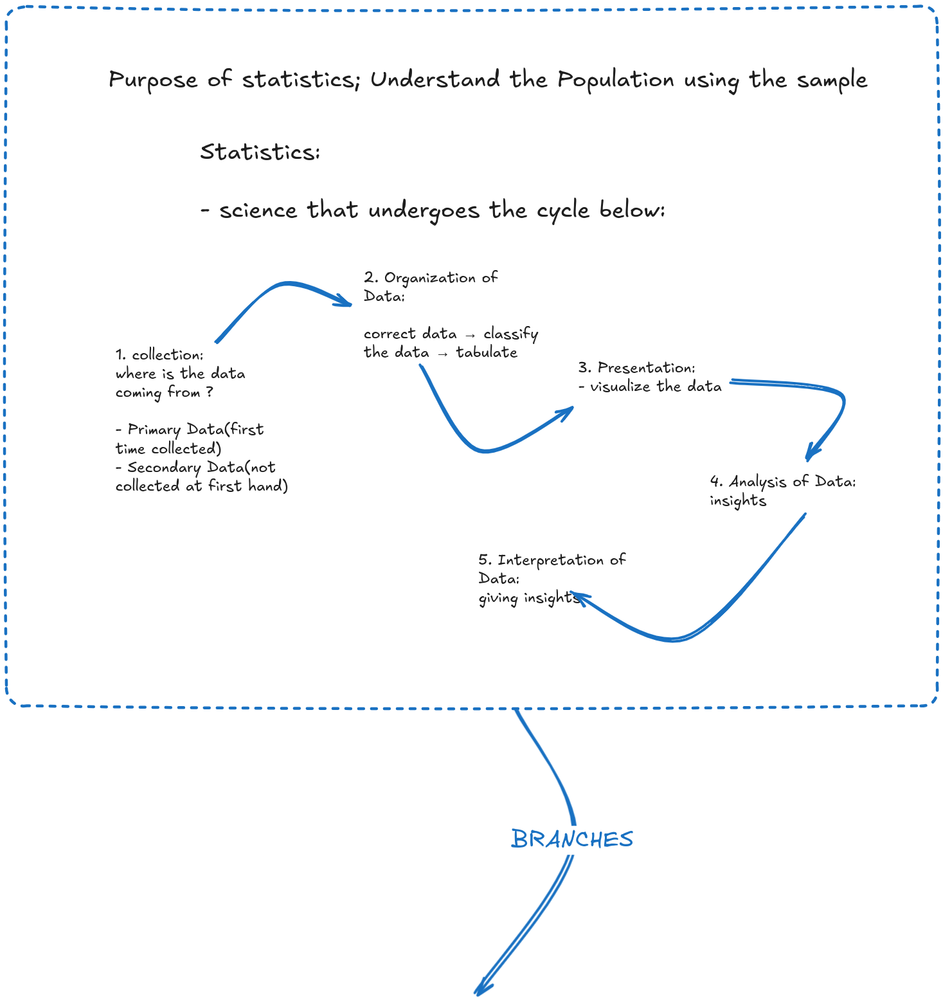

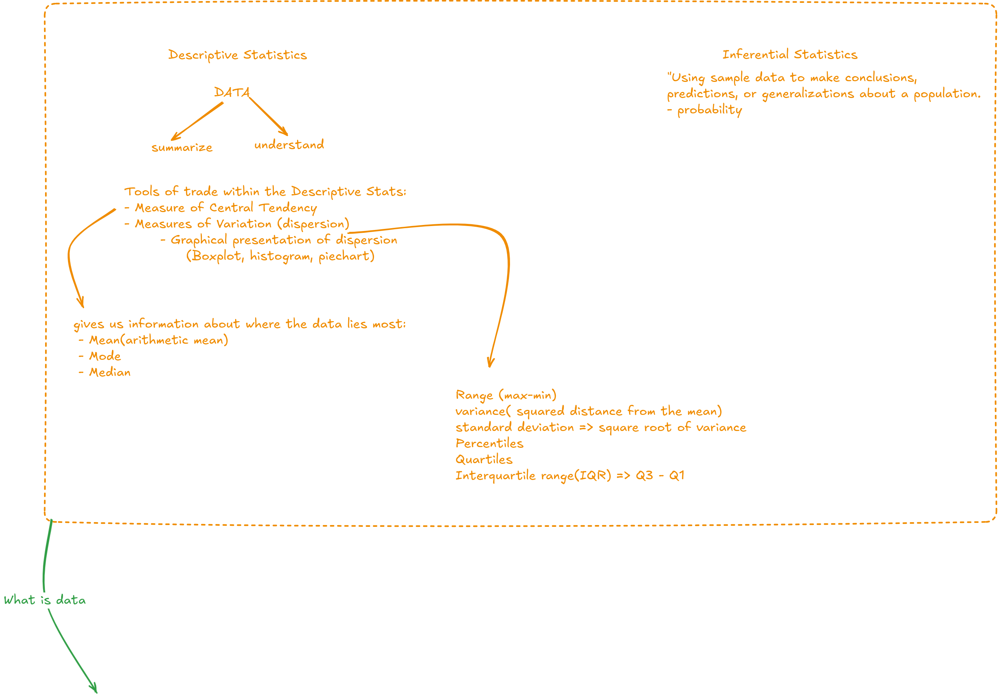

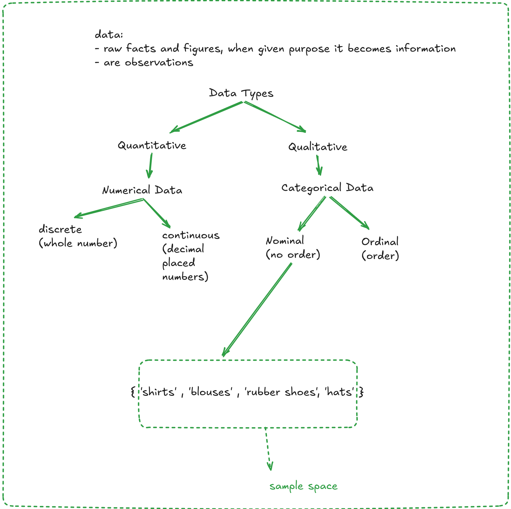

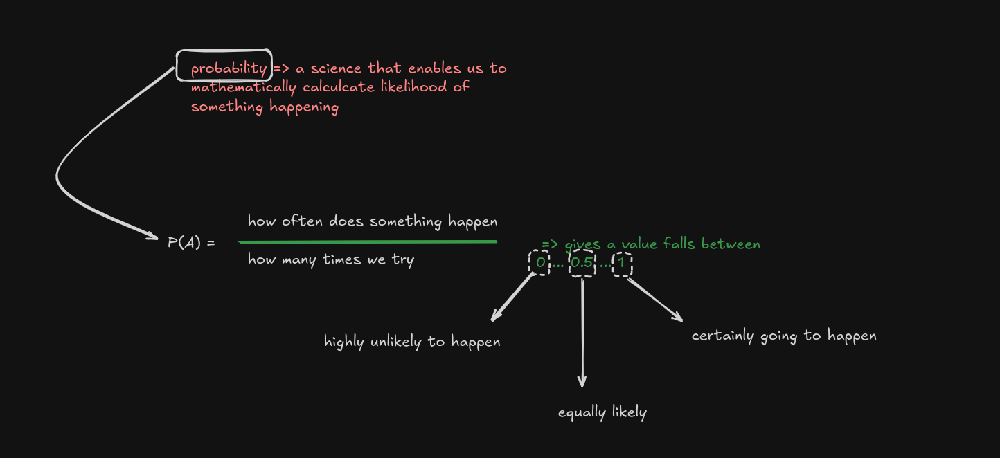

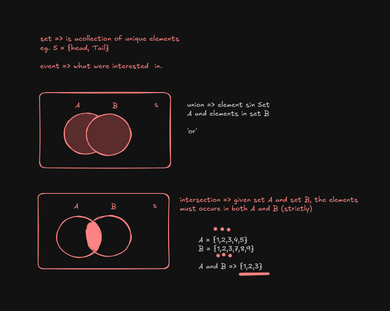

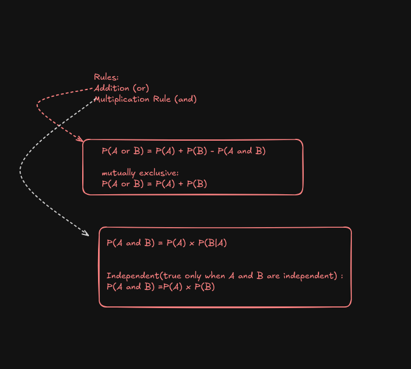

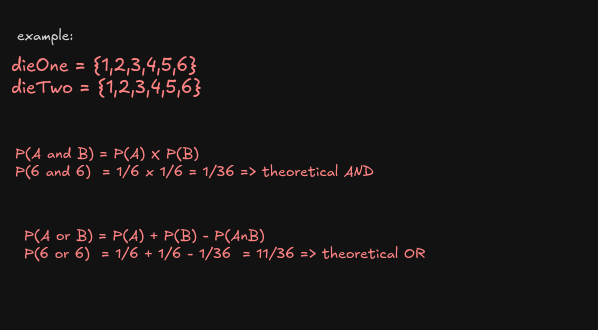

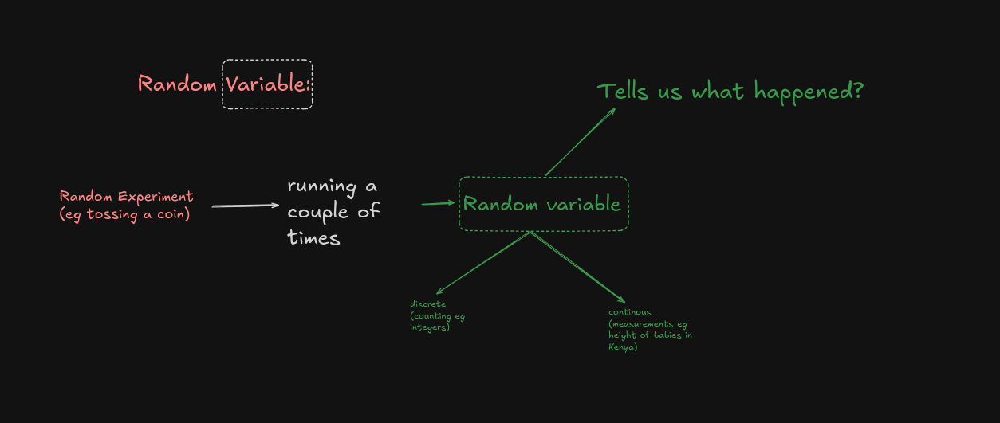

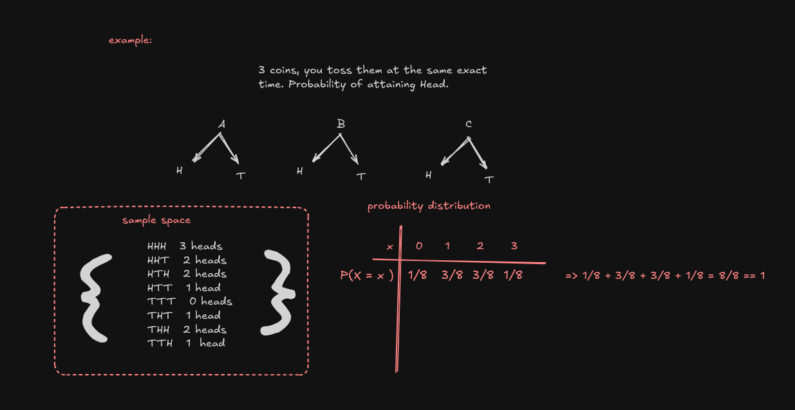

## **Binomial Distribution:**
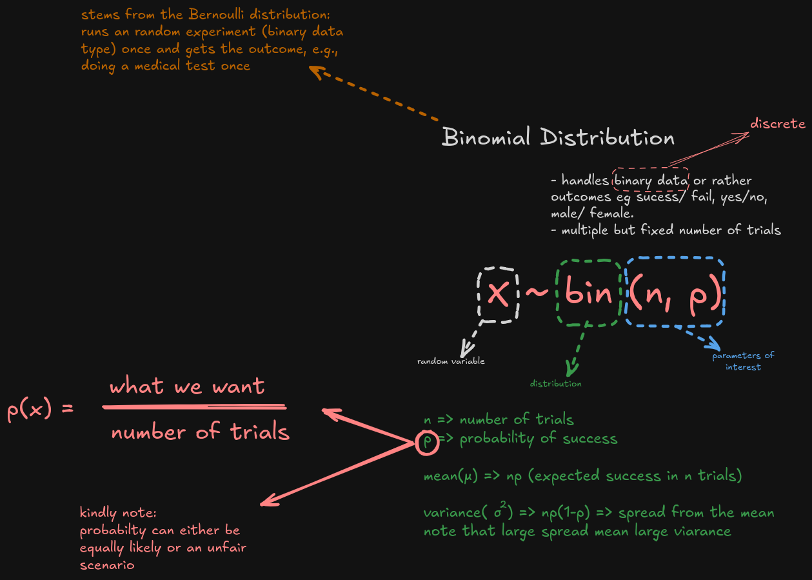

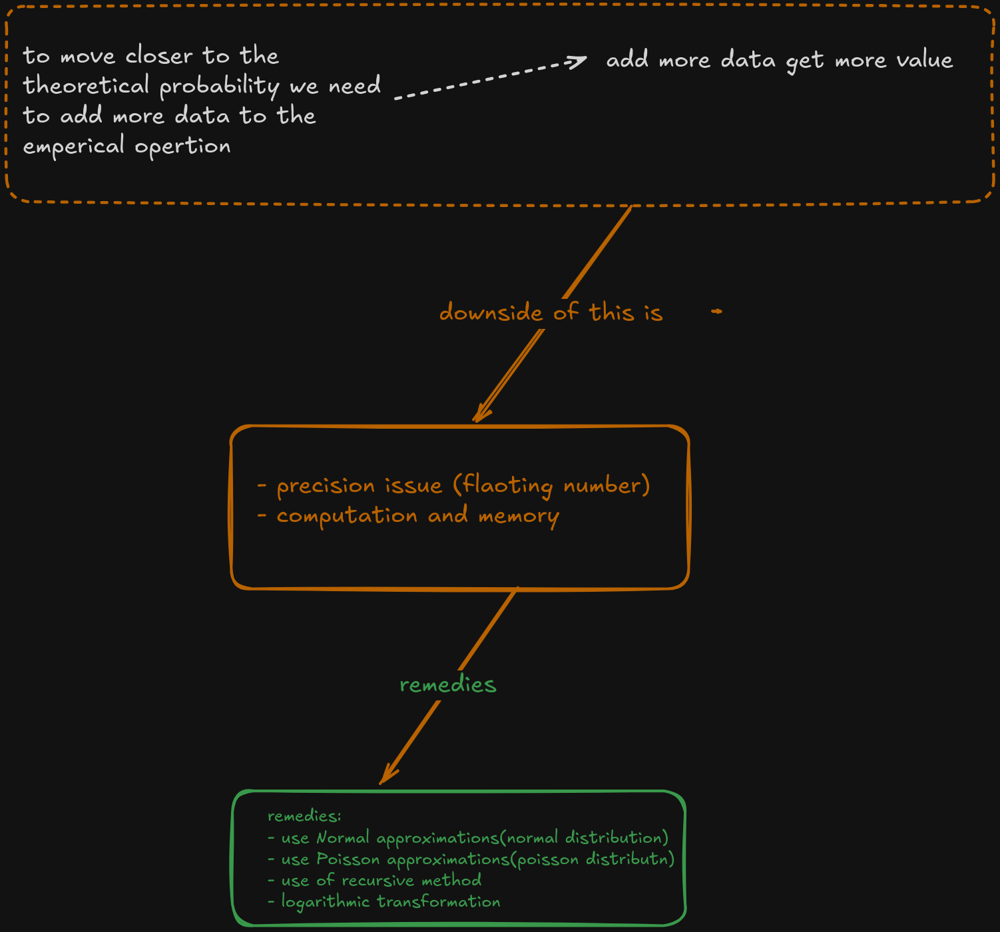

## **Poisson Distribution:**

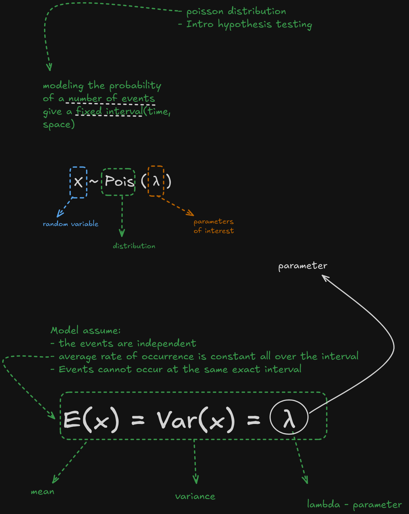

 

 

## **Hypothesis Testing:**

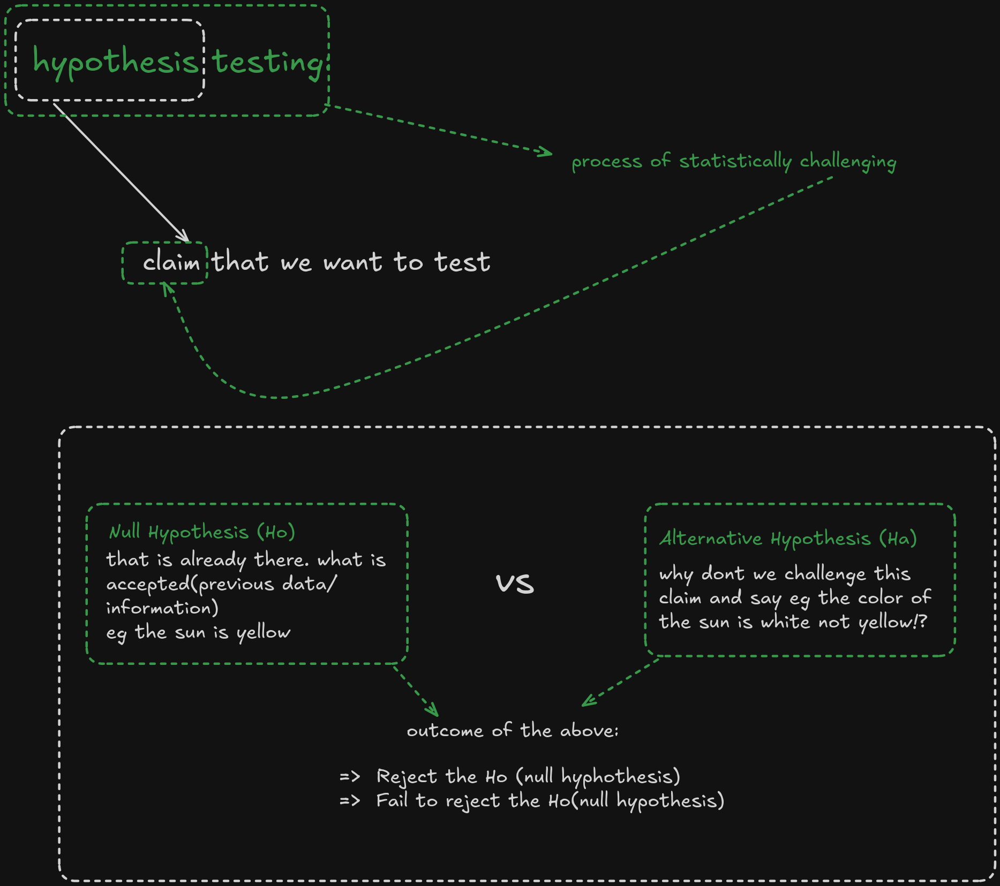

 

#### Note: 
- Each of the data set used in the sessoins have been cited to the sources. 

- Our core Methodology: Crisp-DM
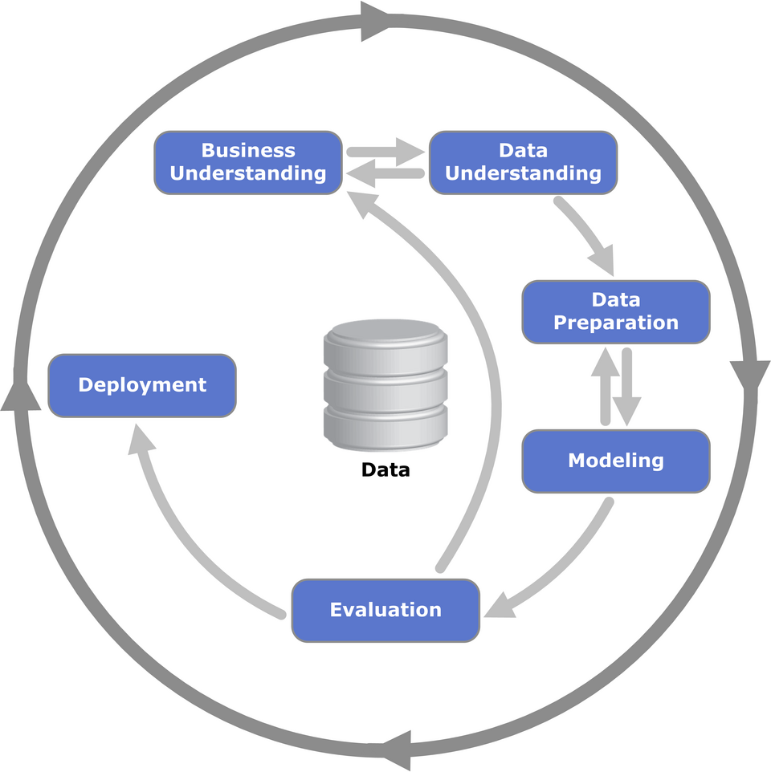