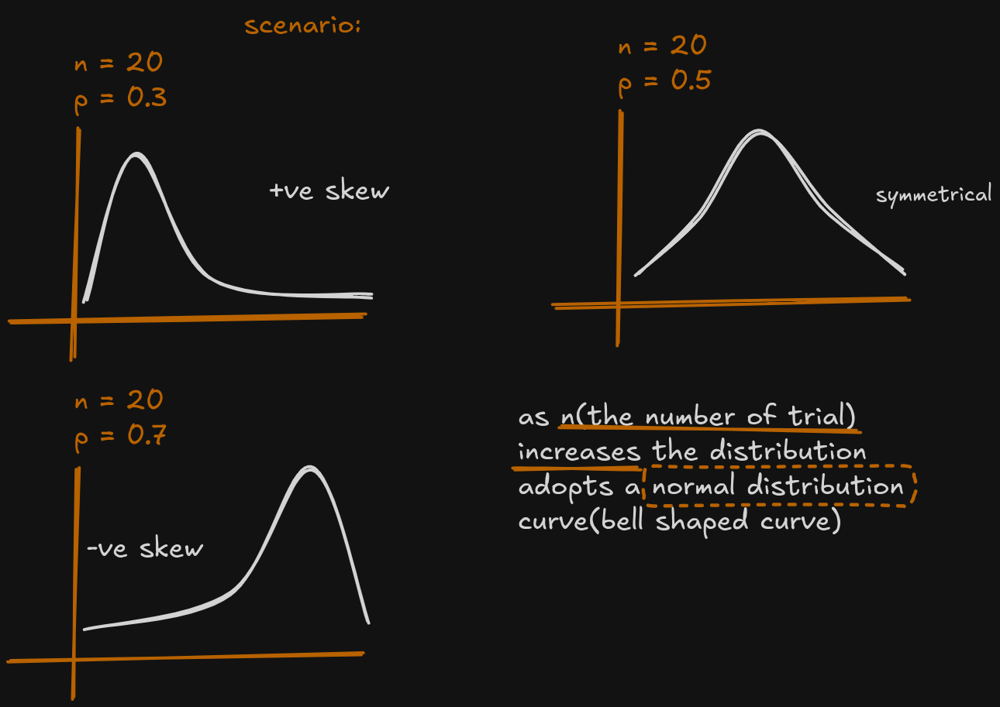
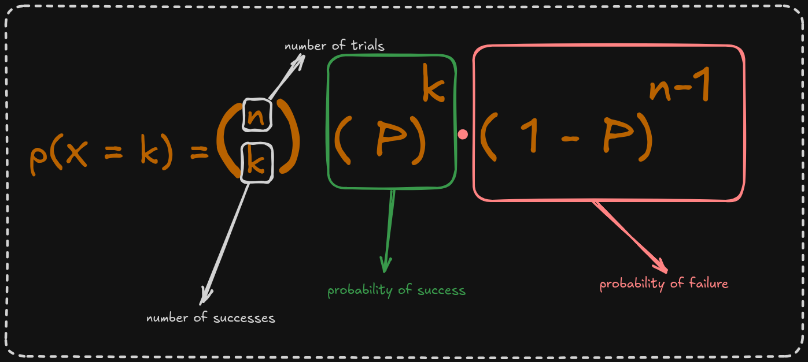
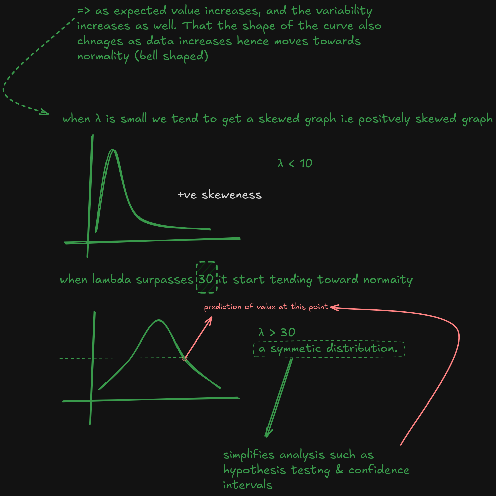
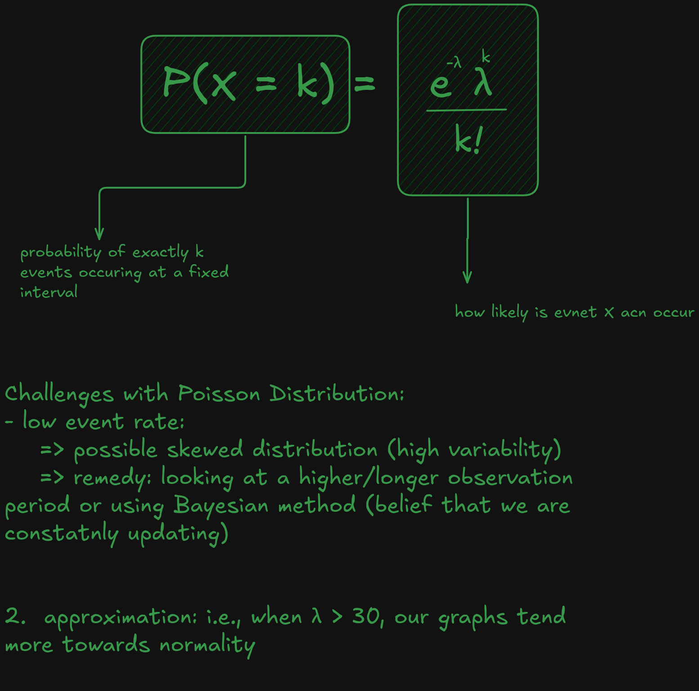
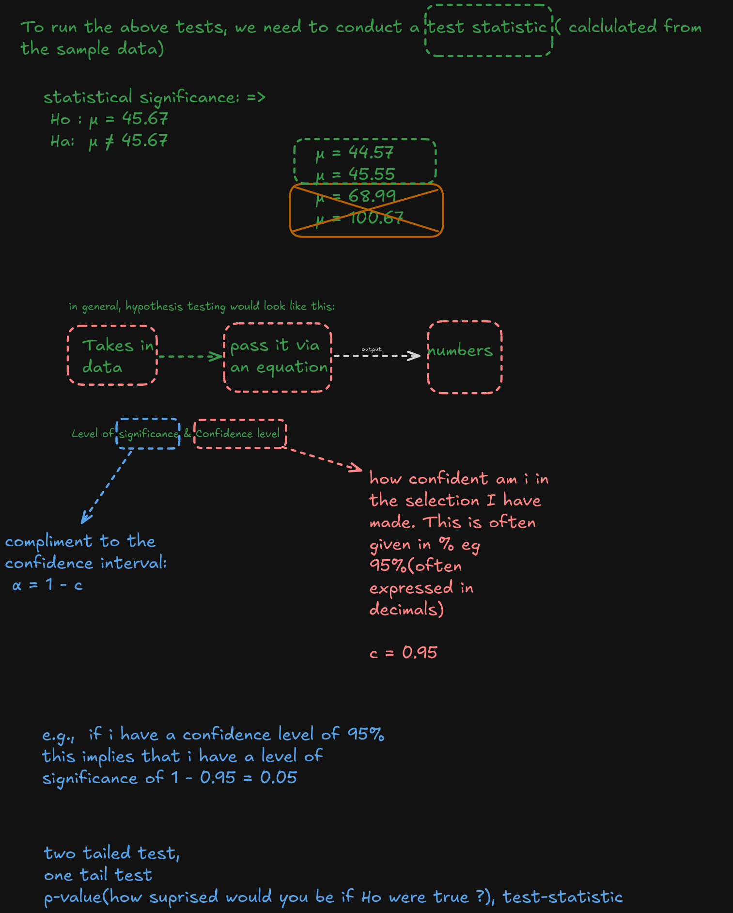

## **Binomial Distribution:**

## **Poisson Distribution:**

 

 

## ***Hypothesis Testing:**

 

#### Note: 
- Each of the data set used in the sessoins have been cited to the sources. 

- Our core Methodology: Crisp-DM
